<p align="center">
  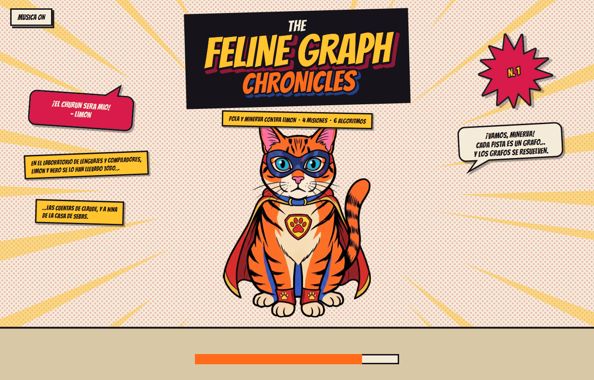
</p>

<h1 align="center">The Feline Graph Chronicles</h1>

<p align="center">
  <b>Pola y Minerva contra Limón y Nero.</b><br>
  Cuatro misiones, seis algoritmos de grafos escritos desde cero y una interfaz de cómic en JavaFX que los dibuja paso a paso.
</p>

<p align="center">
  
  
  
  
  
</p>

<p align="center">
  Lenguajes y Compiladores · Universidad EIA
</p>

---

## Índice

1. [La historia](#la-historia)
2. [Integrantes](#integrantes)
3. [Cómo compilar y ejecutar](#cómo-compilar-y-ejecutar)
4. [Recorrido por la aplicación](#recorrido-por-la-aplicación)
5. [Las cuatro misiones](#las-cuatro-misiones)
   - [Misión 1 — Rescatando a Nina (BFS y DFS)](#misión-1--rescatando-a-nina)
   - [Misión 2 — Las cuentas de Claude (Dijkstra)](#misión-2--las-cuentas-de-claude)
   - [Misión 3 — El botín de churun (Floyd-Warshall y Bellman-Ford)](#misión-3--el-botín-de-churun)
   - [Misión 4 — Reconectando la red (Kruskal)](#misión-4--reconectando-la-red)
6. [Resumen de complejidades](#resumen-de-complejidades)
7. [Robustez: entradas inválidas e instancias grandes](#robustez-entradas-inválidas-e-instancias-grandes)
8. [Estructura del proyecto](#estructura-del-proyecto)
9. [Pruebas](#pruebas)
10. [Decisiones tomadas](#decisiones-tomadas)
11. [Recursos de terceros](#recursos-de-terceros)
12. [Limitaciones conocidas](#limitaciones-conocidas)
13. [Uso de IA](#uso-de-ia)

---

## La historia

> *En el laboratorio de Lenguajes y Compiladores, Limón y Nero se lo han llevado todo:
> las cuentas de Claude, el churun… y a Nina, de la casa de Sebas.*

Cada pista que dejaron los villanos es un grafo. Pola, la heroína, y Minerva, la
estratega, tienen que resolverlas una por una.

| | Personaje | Papel | Misión |
|:---:|---|---|:---:|
| 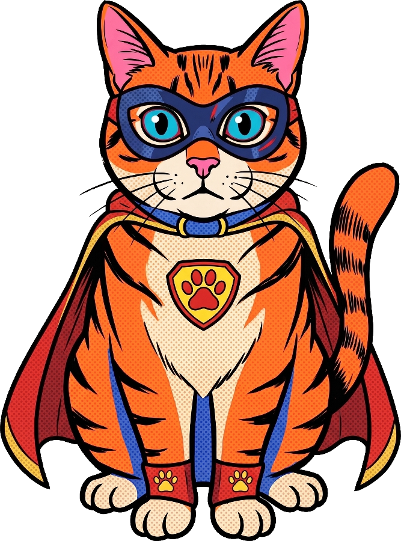 | **Pola** | La heroína. Cruza el campo minado para llegar a Nina. | 1 |
| 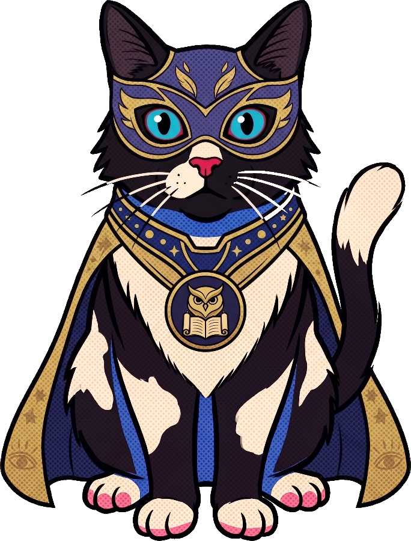 | **Minerva** | La estratega. Encuentra la ruta más barata hasta el mainframe. | 2 |
| 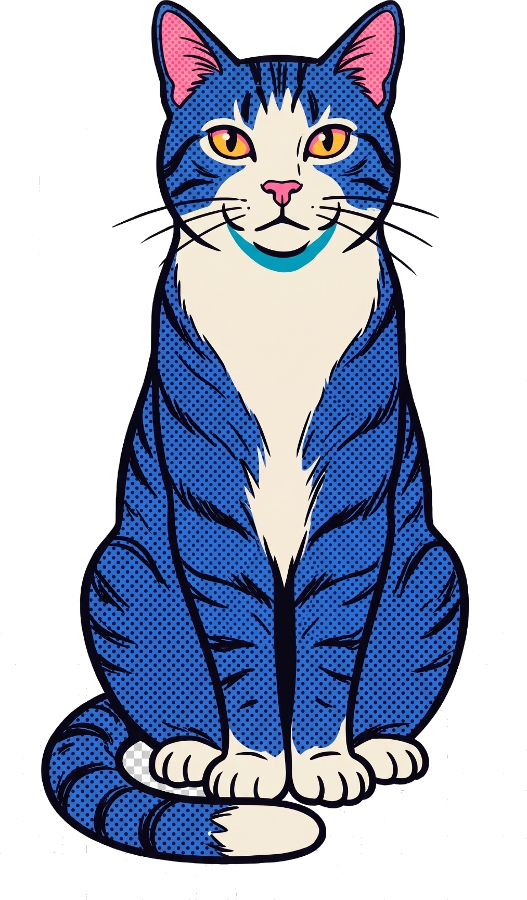 | **Nero** | El secuaz. Esconde el churun tras pasadizos envenenados. | 3 |
| 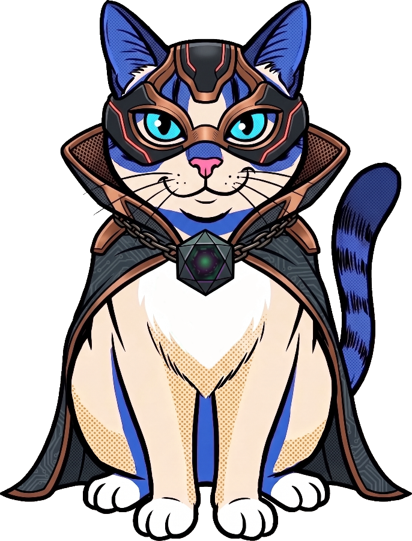 | **Limón** | El jefe. Cortó los cables de la red de la universidad. | 4 |

---

## Integrantes

| Integrante | Aporte principal |
|---|---|
| **Juan Pablo Alzate** | Lógica de las Misiones 1 y 2 (BFS, DFS, Dijkstra) · reestructuración a Maven · interfaz gráfica, visualizadores y estilo de cómic |
| **Jerónimo Duque** | Lógica de las Misiones 3 y 4 (Floyd-Warshall, Bellman-Ford, Kruskal con union-find) · integración de ambas en la interfaz · zoom, arrastre y paneo de los grafos · corrección del dibujo de ciclos |

El historial completo de ramas y pull requests está en el repositorio.

---

## Cómo compilar y ejecutar

**Requisitos:** JDK 17 o superior y Maven. Nada más: JavaFX y JUnit los descarga Maven.

```bash
mvn javafx:run
```

Ese es el único comando necesario desde un clon limpio. La primera vez necesita
conexión a internet para bajar las dependencias; después funciona sin red.

### Pruebas

```bash
mvn test
```

### Ejecutar una misión sin abrir la ventana

Cada solver tiene un `main()` que lee de la entrada estándar y escribe exactamente
lo que se compara contra el enunciado:

```bash
mvn -q compile
java -cp target/classes com.eia.feline.missions.MissionOneSolver   < entrada.txt
java -cp target/classes com.eia.feline.missions.MissionTwoSolver   < entrada.txt
java -cp target/classes com.eia.feline.missions.MissionThreeSolver < entrada.txt
java -cp target/classes com.eia.feline.missions.MissionFourSolver  < entrada.txt
```

> **En PowerShell** el operador `<` no existe. Usa una tubería:
> `Get-Content entrada.txt | java -cp target/classes com.eia.feline.missions.MissionOneSolver`

---

## Recorrido por la aplicación

### 1. Portada

La aplicación abre con una portada de cómic mientras carga: Pola en pose de
heroína, los bocadillos de la historia y el tema musical en bucle (con botón para
silenciarlo arriba a la izquierda). Al llenarse la barra pasa sola al menú.

### 2. Selección de misión

<p align="center">
  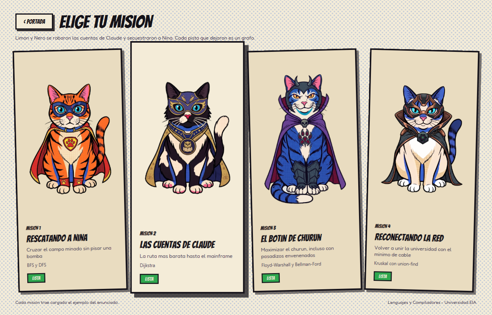
</p>

Una viñeta por misión, con su personaje, el algoritmo que usa y su estado. Al pasar
el ratón la viñeta se endereza y se levanta; al hacer clic se abre la misión.

### 3. Pantalla de misión

Las cuatro misiones comparten **la misma pantalla** (`MissionScreen`), configurada
por un `MissionDescriptor`:

| Zona | Qué hace |
|---|---|
| **Entrada** (arriba a la izquierda) | Texto editable. Viene cargado con el ejemplo del enunciado; *Cargar ejemplo* lo restaura y *Resolver* ejecuta el algoritmo. |
| **Salida** (abajo a la izquierda) | La salida exacta, carácter por carácter, y un selector del caso a dibujar. |
| **Visualización** (centro) | El dibujo del caso elegido. En los grafos: rueda = zoom, arrastrar el fondo = mover, arrastrar un nodo = reacomodar. |
| **Reproducción** (abajo) | Reproducir / pausa, paso atrás y adelante, reiniciar, barra de avance y velocidad de 0,1x a 2x. |

El cálculo corre en un hilo aparte (`Task`), así que la ventana nunca se congela,
ni siquiera con la cuadrícula máxima de 1000 × 1000.

---

## Las cuatro misiones

### Misión 1 — Rescatando a Nina

**Algoritmos:** BFS y DFS sobre una cuadrícula · **Personaje:** Pola

Nina está al otro lado de un campo minado de hasta 1000 × 1000 celdas. Pola se
mueve arriba, abajo, izquierda y derecha, sin pisar bombas. Hay que reportar
cuántos movimientos usa **BFS** (el camino más corto) y cuántos **DFS** (un camino
válido, explorando en el orden *arriba, abajo, izquierda, derecha*).

<p align="center">
  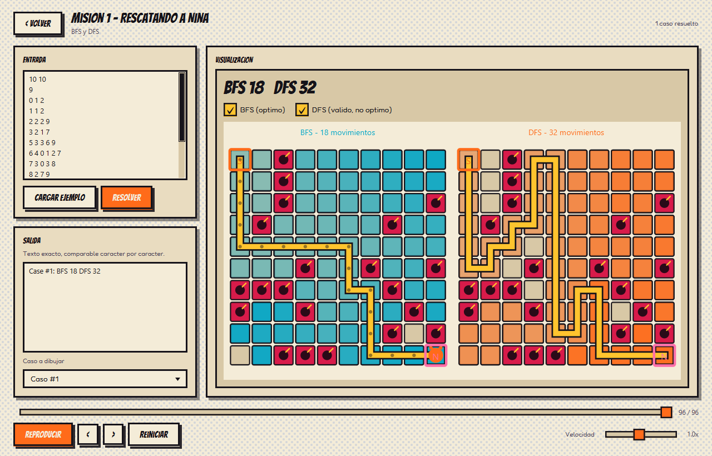
</p>

BFS (cian) y DFS (naranja) se dibujan **en tableros separados, lado a lado**, con
el camino final en dorado. Así se ve de un vistazo por qué BFS llega en 18
movimientos y DFS en 32. Durante la animación se ve cómo crece cada frontera: BFS
avanza por niveles y DFS se mete hasta el fondo de una rama antes de retroceder.

<p align="center">
  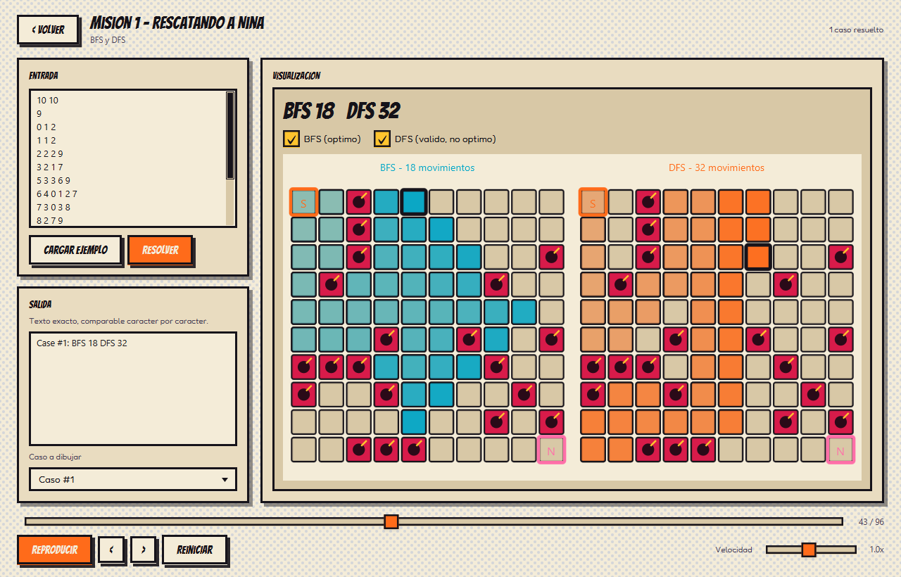
</p>

<details>
<summary><b>Formato de entrada y salida</b></summary>

```
R C                                  filas y columnas (0 0 termina la entrada)
filasConBombas
fila cuantasBombas col1 col2 ...     una línea por fila con bombas
filaInicio colInicio
filaDestino colDestino
```

Salida por caso:

```
Case #k: BFS <b> DFS <d>
Case #k: Nina is unreachable
```

Con el ejemplo del enunciado: `Case #1: BFS 18 DFS 32`.
</details>

| | Tiempo | Espacio |
|---|---|---|
| BFS | O(V + E) = O(R·C) | O(V) |
| DFS iterativo | O(V + E) = O(R·C) | O(V + E) por la pila explícita |

**¿Por qué BFS?** En un grafo no ponderado todas las aristas cuestan lo mismo, así
que descubrir por niveles equivale a descubrir por distancia: la primera vez que se
toca a Nina es, necesariamente, por el camino más corto. DFS no da esa garantía, y
la diferencia entre los dos números es justo lo que la misión quiere mostrar.

---

### Misión 2 — Las cuentas de Claude

**Algoritmo:** Dijkstra con min-heap · **Personaje:** Minerva

Las cuentas de Claude están en el mainframe. La red tiene hasta 10.000 nodos y
100.000 conexiones bidireccionales con costos no negativos de hasta 1.000.000.
Hay que encontrar la ruta más barata.

<p align="center">
  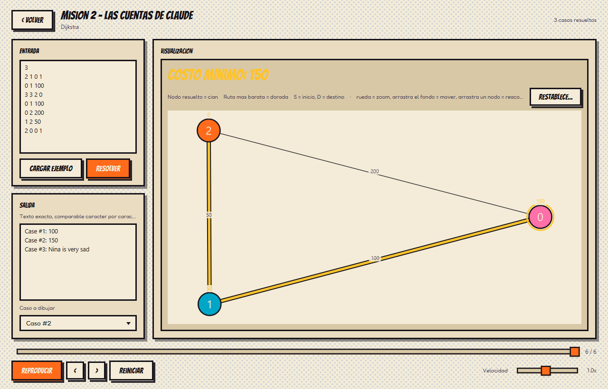
</p>

Los nodos se vuelven cian a medida que Dijkstra los resuelve, en orden creciente de
costo; sobre cada nodo se muestra su distancia y la ruta más barata queda en dorado.

<details>
<summary><b>Formato de entrada y salida</b></summary>

```
T                     número de casos
N C S D               nodos, conexiones, inicio, destino
A B W                 C veces: conexión bidireccional de costo W >= 0
```

Salida por caso:

```
Case #k: <costo>
Case #k: Nina is very sad
```

Con el ejemplo del enunciado:

```
Case #1: 100
Case #2: 150
Case #3: Nina is very sad
```
</details>

| | Tiempo | Espacio |
|---|---|---|
| Dijkstra (heap binario, variante *lazy*) | O((N + M) log N) | O(N + M) |

**¿Por qué Dijkstra?** Los pesos son no negativos, y esa es exactamente la
condición que lo hace correcto: cuando un nodo sale del heap ya no puede existir un
camino más barato hacia él. Con un solo peso negativo esa garantía se cae, que es
por lo que la Misión 3 necesita otro algoritmo.

---

### Misión 3 — El botín de churun

**Algoritmos:** Floyd-Warshall y Bellman-Ford, ambos de **maximización** · **Personaje:** Nero

Nero escondió el churun en un laberinto de hasta 100 cámaras y 5.000 pasadizos
**dirigidos**. Cada pasadizo da churun (peso positivo) o está envenenado y lo quita
(peso negativo, hasta −1000). Se puede repetir cámaras y pasadizos: hay que
encontrar el **máximo** churun acumulable de S a D.

<p align="center">
  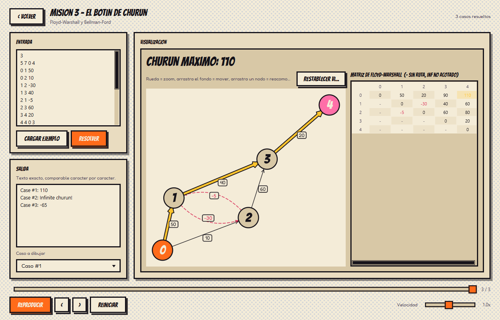
</p>

A la izquierda, el grafo: los pasadizos envenenados en rojo punteado y la ruta
óptima en dorado. A la derecha, **la matriz N × N completa de Floyd-Warshall**,
desplazable para cualquier N ≤ 100, con la casilla (S, D) resaltada.

Si existe un ciclo de ganancia positiva que se pueda alcanzar desde S y que lleve
hasta D, el churun es infinito: no hay ruta máxima que dibujar, así que la
aplicación marca en la matriz todos los pares no acotados (`inf`) y la animación da
vueltas sobre el ciclo responsable, que Bellman-Ford identificó.

<p align="center">
  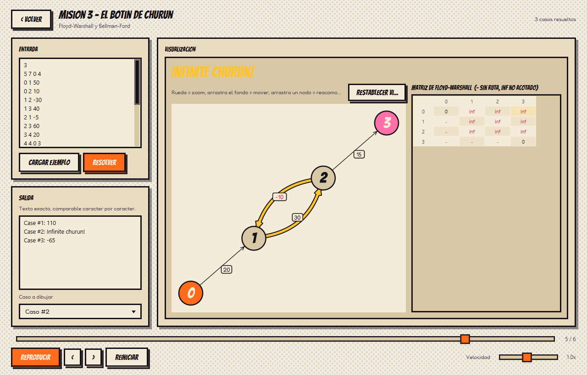
</p>

<p align="center"><sub>El pasadizo 1 → 2 da 30 y el 2 → 1 quita 10: cada vuelta suma 20 de churun, para siempre.</sub></p>

<details>
<summary><b>Formato de entrada y salida</b></summary>

```
T                     número de casos
N M S D               cámaras, pasadizos, inicio, destino
A B W                 M veces: pasadizo dirigido de A a B, -1000 <= W <= 1000
```

Salida por caso, en este orden de prioridad:

```
Case #k: Limon blocked the way      D no es alcanzable desde S
Case #k: Infinite churun!           hay un ciclo positivo en algún camino de S a D
Case #k: <churun>                   el máximo, que puede ser negativo
```

Con el ejemplo del enunciado:

```
Case #1: 110
Case #2: Infinite churun!
Case #3: -65
```
</details>

| | Tiempo | Espacio |
|---|---|---|
| Floyd-Warshall (todos los pares) | O(N³) | O(N²) |
| Bellman-Ford (un origen) | O(N · M) | O(N + M) |

**¿Por qué los dos?** Hay pesos negativos, lo que descarta a Dijkstra, y hay que
detectar ciclos positivos. **Bellman-Ford** resuelve desde S y, con una ronda extra
de relajación, identifica el ciclo concreto para dibujarlo. **Floyd-Warshall**
resuelve todos los pares a la vez, que es lo que alimenta la matriz. Los dos se
ejecutan en todos los casos y el solver **compara sus respuestas para (S, D)**: si
algún día discreparan, la interfaz lo muestra con un aviso rojo.

---

### Misión 4 — Reconectando la red

**Algoritmo:** Kruskal con union-find · **Personaje:** Limón

Limón cortó la red de la universidad. Hay hasta 10.000 intersecciones y 100.000
cables posibles con su costo. Hay que volver a conectar todo con el **mínimo costo
total**: un árbol de expansión mínima.

<p align="center">
  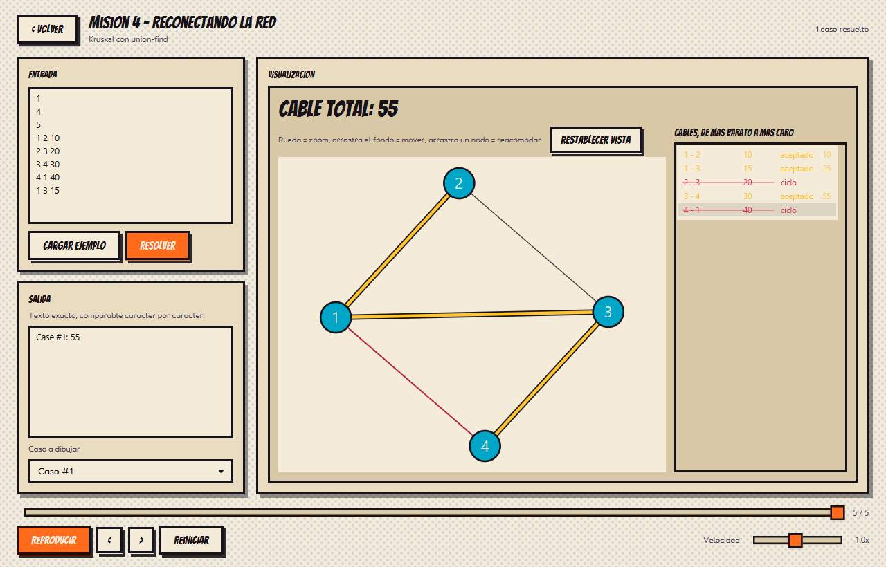
</p>

A la derecha, los cables ordenados de más barato a más caro. La animación los
examina uno por uno: los que entran al árbol se pintan en dorado y suman al total;
los que cerrarían un ciclo se tachan en rojo.

<p align="center">
  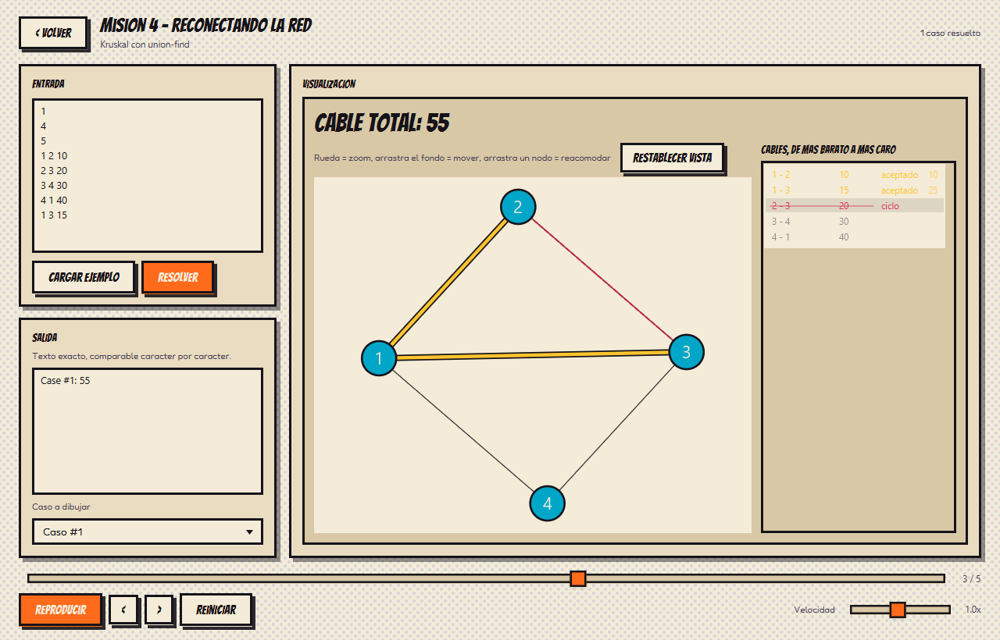
</p>

<details>
<summary><b>Formato de entrada y salida</b></summary>

```
T                     número de casos
N                     intersecciones, numeradas de 1 a N
C                     cables
a b costo             C veces
```

Salida por caso:

```
Case #k: <costo total>
Case #k: Limon cut too many cables
```

Con el ejemplo del enunciado: `Case #1: 55`.
</details>

| | Tiempo | Espacio |
|---|---|---|
| Kruskal + union-find | O(C log C), dominado por el ordenamiento | O(N + C) |

**¿Por qué Kruskal?** El problema pide literalmente un árbol de expansión mínima.
Kruskal es voraz sobre los cables ordenados por costo: un cable entra si y solo si
sus extremos todavía no están conectados. El union-find, con compresión de caminos
y unión por tamaño, responde esa pregunta en tiempo prácticamente constante.

---

## Resumen de complejidades

| Misión | Algoritmo | Tiempo | Espacio | Límites del enunciado |
|:---:|---|---|---|---|
| 1 | BFS | O(R·C) | O(R·C) | R, C ≤ 1000 |
| 1 | DFS iterativo | O(R·C) | O(R·C) | R, C ≤ 1000 |
| 2 | Dijkstra | O((N + M) log N) | O(N + M) | N ≤ 10⁴, M ≤ 10⁵, W ≤ 10⁶ |
| 3 | Floyd-Warshall | O(N³) | O(N²) | N ≤ 100, M ≤ 5000 |
| 3 | Bellman-Ford | O(N · M) | O(N + M) | \|W\| ≤ 1000 |
| 4 | Kruskal + union-find | O(C log C) | O(N + C) | N ≤ 10⁴, C ≤ 10⁵ |

Cada clase de `algo/` lleva un comentario con su complejidad y con la razón por la
que ese algoritmo es el adecuado para su misión.

---

## Robustez: entradas inválidas e instancias grandes

**Una entrada mal formada nunca produce una traza de pila.** Todo se lee a través
de `Tokenizer`, que nombra el dato que esperaba, el token que encontró y su
posición. `InputFormatException` es una excepción *checked*, así que ningún
llamador puede olvidarse de manejarla.

<p align="center">
  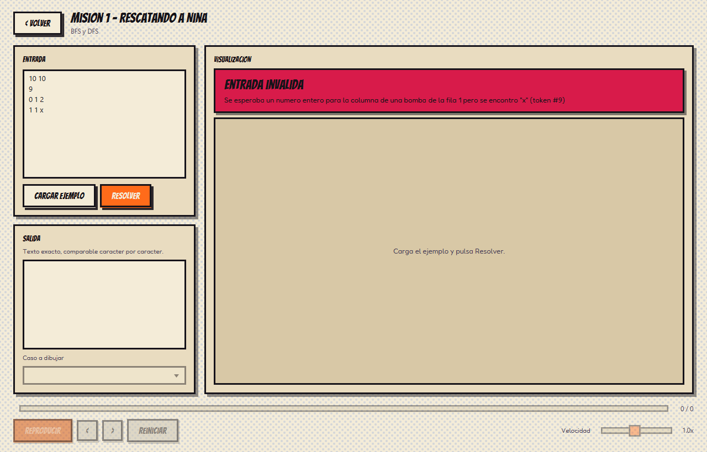
</p>

**Por encima de los topes de dibujo, se calcula igual.** El enunciado limita el
dibujo (cuadrículas de 50 × 50, 60 nodos en las Misiones 2 y 3, 100 intersecciones
y 300 cables en la Misión 4). Si la instancia los supera, la respuesta se sigue
mostrando completa junto a un aviso que explica por qué se omitió el dibujo.

<p align="center">
  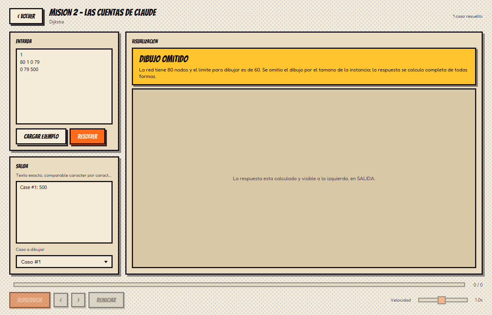
</p>

---

## Estructura del proyecto

Tres capas, y la flecha de dependencia apunta siempre en el mismo sentido:

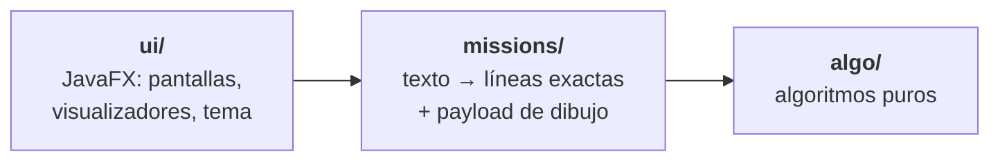

`algo/` y `missions/` no importan nada de JavaFX, Swing ni AWT, y una prueba
(`AlgoPurityTest`) hace fallar la compilación si alguna vez ocurre.

```
src/main/java/com/eia/feline/
├── algo/                 algoritmos puros
│   ├── graph/            WeightedGraph · EdgeList
│   ├── grid/             GridGraph — el tablero de la Misión 1 como grafo
│   ├── search/           BFS · DFS · SearchResult
│   ├── sp/               Dijkstra · ShortestPathResult
│   ├── maxwalk/          FloydWarshall · AllPairsResult · BellmanFord · MaxWalkResult
│   └── mst/              Kruskal (con UnionFind anidado) · MstResult
├── missions/             Tokenizer · InputFormatException · MissionSolver · CaseResult
│                         MissionOneSolver · MissionTwoSolver · MissionThreeSolver · MissionFourSolver
└── ui/                   App · Launcher
    ├── theme/            Theme · Fonts            (+ theme.css en resources)
    ├── screen/           Navigator · LoadingScreen · MissionSelectScreen · MissionScreen
    │                     MissionDescriptor · Missions
    ├── viz/              Visualizer · Playback · GridVisualizer · GraphVisualizer
    │                     MaxWalkVisualizer · MstVisualizer · MatrixPane · SpringLayout
    │                     EdgeCurves · GraphCanvasInteraction
    └── fx/               Art · CatArt · Ink · Music

src/main/resources/com/eia/feline/ui/
├── art/png/              retratos de los personajes
├── audio/theme.wav       tema musical sintetizado por el proyecto
├── fonts/                Bangers · Fredoka (OFL)
└── theme.css

src/test/java/            58 pruebas JUnit 5
tools/ThemeSynth.java     generador del tema musical
docs/img/                 capturas de este README
```

### Los dos contratos que sostienen todo

**`MissionSolver<P>`** devuelve un `CaseResult` por caso de prueba:

```java
public record CaseResult<P>(int index, String outputLine, P payload) {}
```

`outputLine` es la línea ya formateada (`"Case #1: BFS 18 DFS 32"`). La interfaz la
concatena y nunca la reinterpreta, así que el texto que se compara automáticamente
se genera en un solo sitio. `payload` es el estado estructurado que necesita el
dibujo.

**`Visualizer<P>`** construye el nodo de dibujo, pinta un payload, lo reproduce
paso a paso y decide si la instancia cabe dentro de los topes de dibujo.

Agregar una misión es agregar un solver, un visualizador y una entrada en
`Missions.all()`. No hace falta escribir otra pantalla.

---

## Pruebas

```bash
mvn test                                             # las 58
mvn test -Dtest=MissionOneSolverTest                 # una clase
mvn test -Dtest=MissionOneSolverTest#statementSample # un método
```

| Clase | Pruebas | Qué cubre |
|---|:---:|---|
| `MissionOneSolverTest` | 13 | ejemplo del enunciado, sin `<` `>` en la salida, orden determinista del DFS, bomba en el inicio, muro de bombas, camino reconstruido válido, cuadrícula de 1000 × 1000 sin agotar memoria, entrada mal formada |
| `MissionTwoSolverTest` | 11 | ejemplo del enunciado, costos que no caben en `int`, duplicados y lazos, pesos cero, nodos fuera de rango, pesos negativos rechazados, el centinela nunca entra en una suma, orden de resolución creciente |
| `MissionThreeSolverTest` | 11 | ejemplo del enunciado, los dos algoritmos coinciden, máximo negativo, prioridad de "blocked" sobre "infinite", ciclo positivo que no llega a D ignorado, detección de discrepancias, matriz con pares no acotados |
| `MissionFourSolverTest` | 9 | ejemplo del enunciado, cables elegidos, orden por costo, red desconectada, una sola intersección, duplicados y lazos, numeración desde 1, compresión de caminos, total en `long` |
| `GridGraphTest` | 6 | orden de vecinos, bordes, bombas aisladas, simetría en 40 cuadrículas aleatorias |
| `TokenizerTest` | 7 | espacios arbitrarios, token no numérico con su posición, fin de entrada, rangos, enteros enormes, negativos |
| `AlgoPurityTest` | 1 | ni un import de JavaFX, Swing o AWT en `algo/` ni en `missions/` |

Cada misión tiene una prueba que compara la salida completa contra el ejemplo del
enunciado, carácter por carácter.

---

## Decisiones tomadas

**DFS iterativo, con pila explícita.** El enunciado permite cuadrículas de hasta
10⁶ celdas; un DFS recursivo abriría hasta un millón de marcos y desbordaría la
pila de la JVM. La pila explícita mueve ese estado al heap. Se marca visitado *al
sacar* y no al empujar, para que el recorrido sea idéntico al del DFS recursivo
canónico; como consecuencia un nodo puede entrar varias veces a la pila, así que su
cota es `aristas + 1`.

**El orden `arriba, abajo, izquierda, derecha` no está en el DFS.** Sale de que
`GridGraph` guarda los vecinos como `derecha, izquierda, abajo, arriba` y la pila es
LIFO. Si se toca uno de los dos archivos hay que tocar el otro; hay pruebas que lo
fijan.

**Lista de adyacencia con `List<List<Integer>>`, no una estructura comprimida.** Se
probaron las dos. Medido en el límite del enunciado (1000 × 1000), una
representación CSR con dos arreglos de `int` gasta 20 MB contra 144 MB y hace el BFS
en 36 ms contra 66 ms. Se eligió igual la lista de listas: **144 MB caben de sobra
en un heap por defecto**, y a cambio la estructura es la que cualquiera lee sin
explicación previa y la que el grupo puede defender línea por línea.

**`long` para los costos acumulados** de las Misiones 2, 3 y 4. Con 10.000 nodos y
pesos de hasta 1.000.000 una ruta llega al orden de 10¹⁰, que no cabe en `int` y se
desbordaría en silencio. El centinela de "sin ruta" es `Long.MAX_VALUE`
(`Long.MIN_VALUE` en la Misión 3, que maximiza) y nunca entra en una suma.

**Una cota en la maximización de la Misión 3.** Con un ciclo positivo, el triple
bucle de Floyd-Warshall duplica el valor en cada iteración de `k` y desbordaría
`long`. Los valores se recortan a 10⁹, muy por encima de cualquier respuesta
legítima (a lo sumo 99 × 1000 = 99.000), así que recortar nunca se confunde con un
resultado real.

**Kruskal ordena índices, no cables.** Así la visualización conserva cada cable en
su posición original y puede mostrar a la vez el orden en que se examinaron.

**La numeración desde 1 de la Misión 4 se convierte en un solo sitio**, al leer la
entrada. Todo lo demás trabaja en base 0 como las otras misiones.

**Aristas duplicadas: se guardan todas.** Deduplicar obliga a buscar en la lista de
vecinos, y con 100.000 aristas incidentes a un mismo nodo esa búsqueda es
cuadrática. Dijkstra y Kruskal se quedan con la mejor sin ayuda.

**Sin librería de grafos, tampoco para dibujar.** La colocación de los nodos es un
Fruchterman-Reingold escrito a mano (`ui/viz/SpringLayout`). Es O(iteraciones · N²),
lo cual solo es aceptable porque el dibujo está limitado a 60 nodos.

**Todo se pinta sobre `Canvas`, no con un nodo por celda.** Una cuadrícula de
50 × 50 son 2.500 celdas y la matriz de la Misión 3 son 10.000 casillas; con un nodo
de escena por casilla la construcción tarda segundos.

**BFS y DFS se dibujan en tableros separados.** La primera versión los superponía
sobre la misma cuadrícula y las dos capas traslúcidas se mezclaban en un color
intermedio que ocultaba qué algoritmo había llegado a qué celda, que es lo único que
esa misión existe para mostrar.

**El cálculo corre fuera del hilo de JavaFX.** Con la cuadrícula del límite resolver
toma del orden de un segundo, y hacerlo en el hilo gráfico congelaría la ventana.

**`Launcher` no extiende `Application`.** Si la clase principal hereda de
`Application`, Java exige que JavaFX esté en el module-path y se niega a arrancar
desde un classpath normal. Con esa indirección de una línea, `mvn javafx:run` y
`java -cp ...` arrancan igual.

---

## Recursos de terceros

El enunciado pide declarar cualquier librería usada solo para dibujar. **No se usa
ninguna**: el grafo se coloca con un Fruchterman-Reingold escrito a mano y todo se
pinta con JavaFX. Las únicas dependencias del `pom.xml` son `javafx-controls`,
`javafx-graphics` y, solo para pruebas, `junit-jupiter`.

### Tipografías

Incrustadas en `src/main/resources/com/eia/feline/ui/fonts/`:

| Fuente | Uso | Licencia |
|---|---|---|
| Bangers | rótulos y títulos | SIL Open Font License 1.1 |
| Fredoka | texto de interfaz | SIL Open Font License 1.1 |

La OFL permite incrustarlas y redistribuirlas; el aviso está en `fonts/OFL.txt`. Si
faltaran, la aplicación cae a una familia del sistema y sigue funcionando (ver
`ui/theme/Fonts.java`).

### Música

**No es de terceros: la genera el propio proyecto.** El tema en bucle
(`ui/audio/theme.wav`, 9,6 s) lo sintetiza `tools/ThemeSynth.java`, que escribe el
WAV nota a nota: progresión i-VI-III-VII en re menor, bajo en onda cuadrada, acordes
y melodía con envolvente. Solo hay que ejecutarlo si se quiere regenerar:

```bash
javac tools/ThemeSynth.java -d /tmp/synth
java -cp /tmp/synth ThemeSynth src/main/resources/com/eia/feline/ui/audio/theme.wav
```

Suena con `javax.sound.sampled` (biblioteca estándar) y no con `javafx.media`, para
no añadir otro módulo al `pom.xml`. Si la máquina no tiene sonido, falla en silencio
y la aplicación funciona igual.

### Arte de los personajes

Los retratos de `ui/art/png/` se generaron a partir de los prompts documentados en
**[`ASSETS.md`](ASSETS.md)**, que también explica cómo integrar piezas nuevas. Si un
retrato faltara, `ui/fx/CatArt` dibuja un gato con figuras primitivas en su lugar.
Las tramas de puntos, estrellas de impacto, bocadillos y líneas de velocidad no son
imágenes: se dibujan por código en `ui/fx/Ink.java`.

---

## Limitaciones conocidas

- **Nina no tiene retrato propio.** La Misión 1 usa el de Pola, la heroína de la
  misión. Los prompts para generarlo están en [`ASSETS.md`](ASSETS.md).
- **JavaFX no carga SVG.** Cualquier arte nuevo tiene que exportarse a PNG (o
  convertir sus trazados a `SVGPath`). Explicado en `ASSETS.md`.
- **La primera compilación necesita internet** para que Maven baje JavaFX y JUnit.
- **Por encima de los topes de dibujo no hay dibujo.** La respuesta numérica se sigue
  mostrando junto a un aviso que explica por qué se omitió.
- **La colocación de nodos es cuadrática en N.** Sería lenta con instancias grandes,
  pero nunca se ejecuta sobre ellas porque el tope de dibujo lo impide antes.
- **Con un heap muy acotado la Misión 1 falla en el límite.** La lista de listas
  necesita unos 192 MB para la cuadrícula de 1000 × 1000 (la versión CSR descartada
  funcionaba con 48 MB). Con la configuración por defecto de la JVM no ocurre.

---

## Uso de IA

Las herramientas usadas, los prompts decisivos, los casos en que la salida generada
estuvo mal y cómo se corrigió, y lo que aprendió cada integrante están en
**[`AI_USAGE.md`](AI_USAGE.md)**.

<p align="center">
  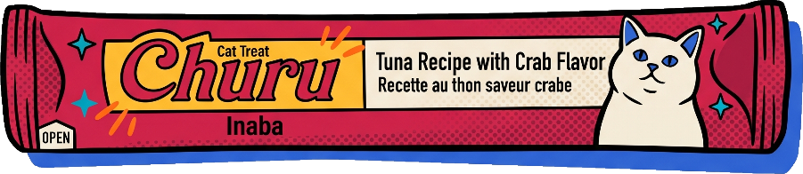
</p>
